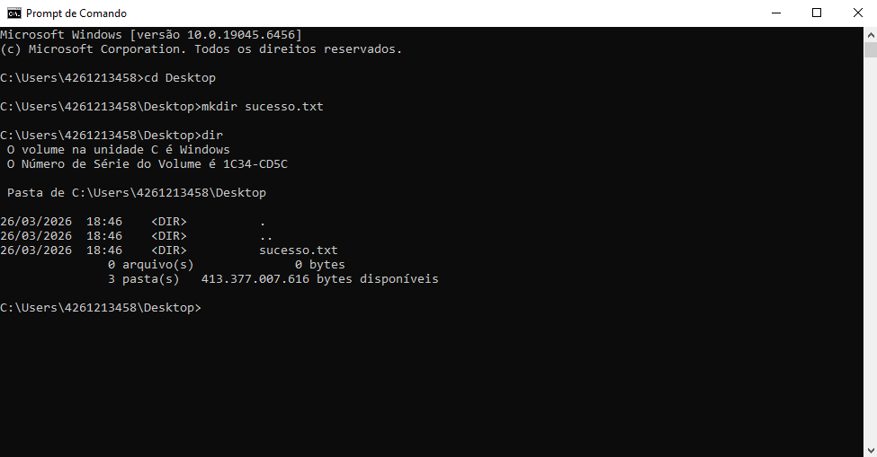

# una-ihcux-lista01

# ⚡ Meus Comandos Favoritos
Aqui estão os comandos que mais utilizei na aula de Terminal:

- `cd`: Para navegar entre pastas.
- `dir`: Para listar arquivos.
- 'mkdir': Para criar arquivos e pastas.
- 'typw nul'
- 'echo pronto'

## 📸 Evidência de Execução

